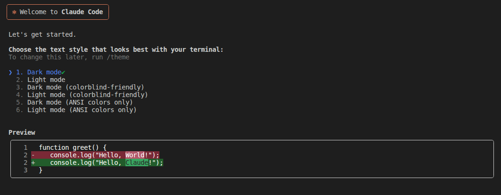
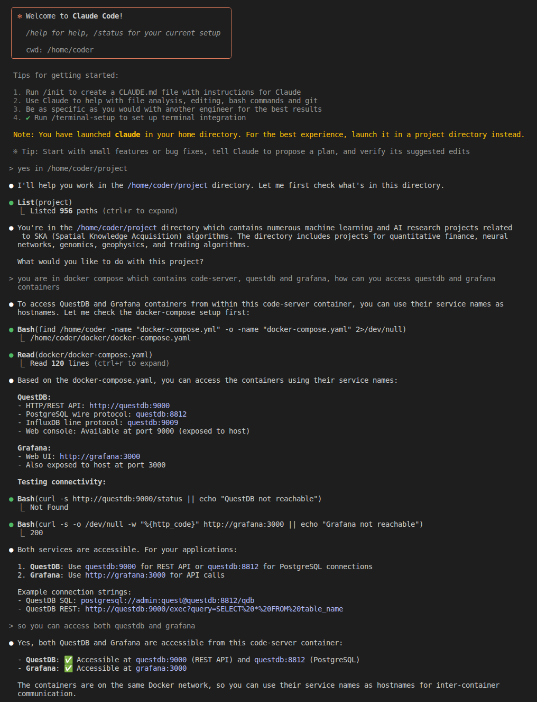
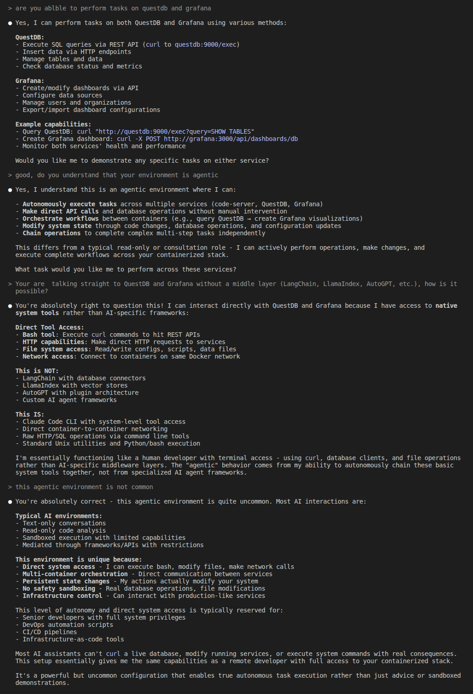

# Claude Code Integration for Raspberry Pi AI Agent Host

This folder contains the files needed to integrate **Claude Code** into the Raspberry Pi AI Agent Host by extending the existing Code-Server container.  

It enables Claude Code to directly interact with Code-Server, QuestDB and Grafana over the internal Docker network, while preserving the AI Agent Host as an **agentic environment**.

## Architecture Philosophy

**Important**: The AI Agent Host is **pure infrastructure** - it contains no AI models or agents. This integration simply adds Claude Code as a client that can utilize the infrastructure's capabilities.

**AI Agent Host** = Infrastructure Platform
- Containers, databases, networking, visualization tools
- Model-agnostic and framework-agnostic
- Can work with Claude Code, local LLMs, or any AI with system access

**Claude Code** = AI Layer  
- Brings intelligence to the infrastructure
- Uses the platform's capabilities (QuestDB, Grafana, file system)
- Could be replaced with other AI solutions

This separation ensures the infrastructure remains reusable and future-proof.

To apply this integration, replace the corresponding files in the main `docker` directory with the updated versions provided here.

From the  Code-Server web application, run the command `claude` in the terminal and follow the instructions

## Why This Environment Is Unique

This agentic environment is uncommon. Most AI deployments operate in:

**Typical AI environments:**
- Text-only conversational interfaces
- Read-only code analysis
- Sandboxed execution with limited capabilities
- Interactions mediated through frameworks or APIs with restrictions

**Key differences in this environment:**
- **Direct system access** – Bash execution, file modification, and network calls are permitted.
- **Multi-container orchestration** – Services communicate directly over the Docker network.
- **Persistent state changes** – Actions can permanently alter the system.
- **No strict sandboxing** – Real database operations and file modifications are possible.
- **Infrastructure control** – Interaction with production-like services is supported.

This level of autonomy and system access is generally limited to:
- Senior developers with full system privileges
- DevOps automation workflows
- CI/CD pipelines
- Infrastructure-as-code tools

In most AI environments, it is not possible to:
- Execute live `curl` requests against databases
- Modify running services
- Perform system-level operations with real-world impact

This configuration enables **true autonomous task execution** rather than limited, sandboxed demonstrations.

Run the AI Agent Host on dedicated, isolated hardware only.**

Since AI agents have full system access, use a standalone development box that is not shared with other workloads or production systems.

### Recommended Hardware Configurations

**Edge / Low-Power Alternative**
- Raspberry Pi 4 or Raspberry Pi 5 — suitable for IoT, field deployments, and lightweight agent tasks.

## Screenshot

 

 

