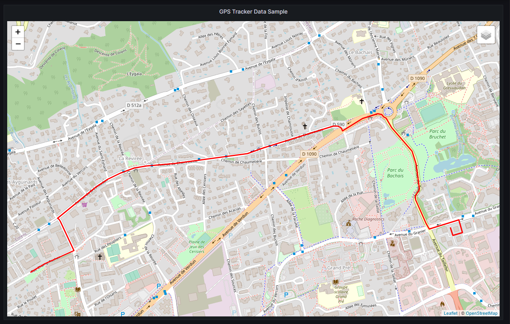

##  Quectel EG25/EC25 Mini PCIe 4G/LTE  GPS Tracker

### Overview

This script is designed to interact with the Quectel EG25/EC25 Mini PCIe 4G/LTE GPS module to retrieve GPS location data and store it in a QuestDB database. It establishes a connection to the database, creates a table if it doesn't exist, and sets up the serial communication with the GPS module. The script continuously queries the GPS module for its information using AT commands and extracts relevant GPS parameters such as latitude, longitude, altitude, speed, and timestamp. These parameters are then transformed and formatted for better readability. The latitude and longitude values are calculated from degree and minute components and stored in the database along with other extracted information. Any errors encountered during the process are gracefully handled, and the serial port and database connection are properly closed at the end. The script offers an efficient and reliable way to capture and manage GPS data from the EG25/EC25 4G HAT GPS module

###  Set up parameter:

After installing the AI Agent Host, open VS Code in your browser through an HTTPS connection. 

Navigate to `>project/vehicle-tracking/data-stream-processing.py`.
The script is pre-configured to connect to a QuestDB instance using the following credentials:

```
dbname="qdb",
user="admin",
password="quest",
host="yourdomain.tld",
port="8812"
```

Remember to replace **<yourdomain.tld>** with the actual domain name that points to the IP address of the Docker host where your Raspberry Pi is running.

### GPS Tracker Data query

```
-- Retrieve the timestamp and data values: latitude, longitude, altitude, speed.

SELECT
    timestamp,        -- Select the timestamp of the data
    data              -- Select the data value
FROM  
    gps_data      -- From the 'gps_data' table
WHERE 
    timestamp > dateadd('d', -1, now()); -- Only select data from the past 24 hours

```

This Grafana query retrieves the timestamp and corresponding data values from the **gps_data** table. It's specifically designed to only fetch data from the last 24 hours, ensuring that dashboard viewers are presented with the most recent day's data trends. By focusing on this short timeframe, users can gain insights into daily data fluctuations and patterns, which can be especially valuable for real-time monitoring or short-term data analysis.


### Run Python File in Terminal:
Execute the Python script from the terminal to start collecting gps data.


### Connect to Grafana Dashboard:
Open your browser and navigate to the Grafana interface. Select the GPS Tracker dashboard to start monitoring your data in real-time





### Customizing the GPS Tracker:

While the pre-configured GPS tracker setup is designed to work out of the box, you can also customize it to match your unique requirements. Here are some steps to consider when customizing the setup:

- **Modify Data Stream Processing**: The Python script responsible for processing GPS data can be customized to include additional data points or calculations. For example, you could include data related to vehicle speed, direction, or any other sensor readings.

- **Enhance Grafana Dashboard**: The Grafana dashboard can be tailored to display the additional data points collected from the GPS tracker. You can add new panels, visualizations, and filters to create a dashboard that provides valuable insights for your specific use case.

- **Integrate with External Services**: If you have specific external services or APIs you'd like to integrate with, you can modify the Python script to send data to those services. This could include data storage in cloud platforms, real-time alerts, or other notifications.

- **Utilize SD Card Storage**: Take advantage of the SD Card slot on the SIM7600G-H 4G to create a backup of the database. This ensures data redundancy and availability in various scenarios.

- **Fine-Tune GPS Accuracy**: Depending on your tracking needs, you can explore ways to improve GPS accuracy, such as fine-tuning the frequency of data collection, incorporating more advanced GPS modules, or implementing data filtering algorithms.

- **Advanced Analytics**: If you're looking to extract advanced insights from the collected GPS data, you can incorporate data analysis techniques, machine learning models, or predictive analytics to derive valuable information from the tracker's data stream.

### Advantages of AI Agent Host-Based GPS Tracker over Traditional Trackers.


The AI Agent Host-Based GPS Tracker offers numerous benefits and advantages compared to traditional GPS trackers. By leveraging advanced technology and a unique approach, this solution provides users with an enhanced tracking experience and greater control over their data. Here are some of the key advantages:

- **Privacy and Control**: The AI Agent Host-Based GPS Tracker operates without relying on third-party tracking services or external servers. This ensures that your location data remains under your control, minimizing the risk of unauthorized access or data sharing.

- **Data Ownership**: With this tracker, you own and control the data generated by the device. Unlike some trackers that might share or monetize your data in exchange for no monthly fees, the AI Agent Host-Based GPS Tracker puts data ownership back in your hands.

- **No Monthly Fees**: Similar to traditional no monthly fee trackers, our solution eliminates the need for recurring subscription costs. However, it goes beyond by offering advanced tracking capabilities without relying on external servers.

- **Customization and Integration**: Tailor the AI Agent Host-Based GPS Tracker to your specific needs. Enjoy the flexibility to customize its behavior, integrate it with other systems, and even develop additional features as required.

- **Advanced Capabilities**: Depending on the AI capabilities you implement, this tracker can provide advanced features such as intelligent route optimization, predictive maintenance, anomaly detection, and more.

- **Security**: Operating within your own environment, the tracker reduces the risk of security breaches associated with external servers. You can implement your own security measures to protect your data effectively.

- **Offline Functionality**: The GPS tracker can continue functioning even when there's no internet connectivity. It can store data locally and sync it when the connection is restored, ensuring seamless tracking under various conditions.

- **Custom Alerts and Triggers**: Set up personalized alerts and triggers based on your criteria. This high level of customization enables you to receive notifications when specific events occur.

- **Learning and Improvement**: Benefit from the AI capabilities of the tracker, which learns from historical data to enhance its functionality over time. This can result in more accurate predictions and valuable insights.

The AI Agent Host-Based GPS Tracker provides users with greater control, privacy, and customization options compared to traditional trackers. It empowers you to design a tracking solution that precisely fits your needs while maintaining ownership of your data and reducing reliance on external services.