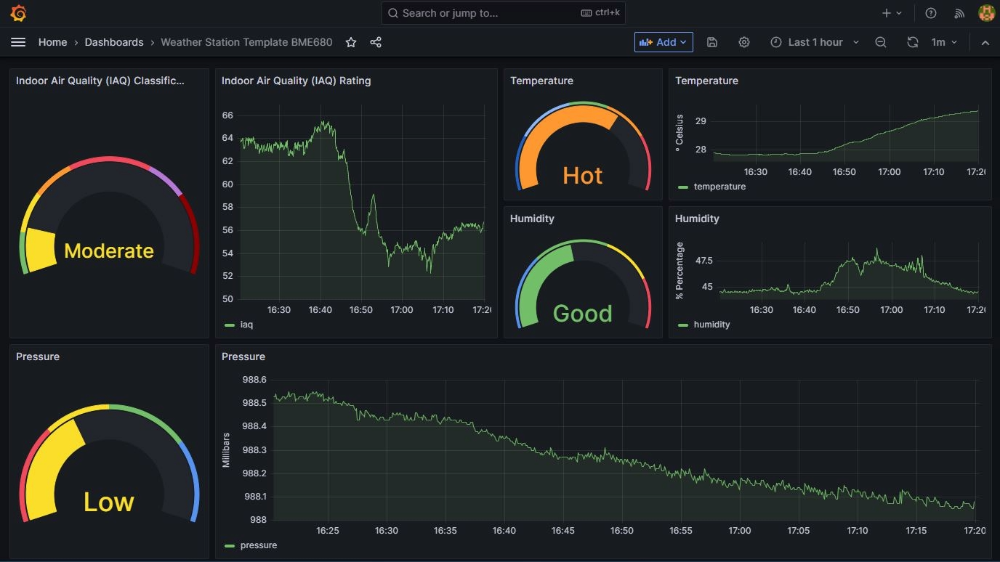

## BME680 Sensor Data Collector

### Overview

This script interfaces with the BME680 environmental sensor, retrieves its readings, and saves the data into a QuestDB database. It covers temperature, humidity, pressure, gas resistance and Indoor Air Quality (IAQ) readings.

###  Set up parameter:

The script is set to connect to a QuestDB instance with the following credentials:

```
dbname="qdb",
user="admin",
password="quest",
host="docker_host_ip_address",
port="8812"
```

Remember to replace **<docker_host_ip_address>** with the actual IP address of the Docker host where your server is running

### Weather Data query

```
-- Retrieve the timestamp and temperature values
SELECT
    timestamp,        -- Select the timestamp of the data
    temperature       -- Select the temperature value
FROM  
    weather_data      -- From the 'weather_data' table
WHERE 
    timestamp > dateadd('d', -1, now()); -- Only select data from the past 24 hours

```

This Grafana query retrieves the timestamp and corresponding temperature values from the **weather_data** table. It's specifically designed to only fetch data from the last 24 hours, ensuring that dashboard viewers are presented with the most recent day's temperature trends. By focusing on this short timeframe, users can gain insights into daily temperature fluctuations and patterns, which can be especially valuable for real-time monitoring or short-term data analysis.

### Dashboard




